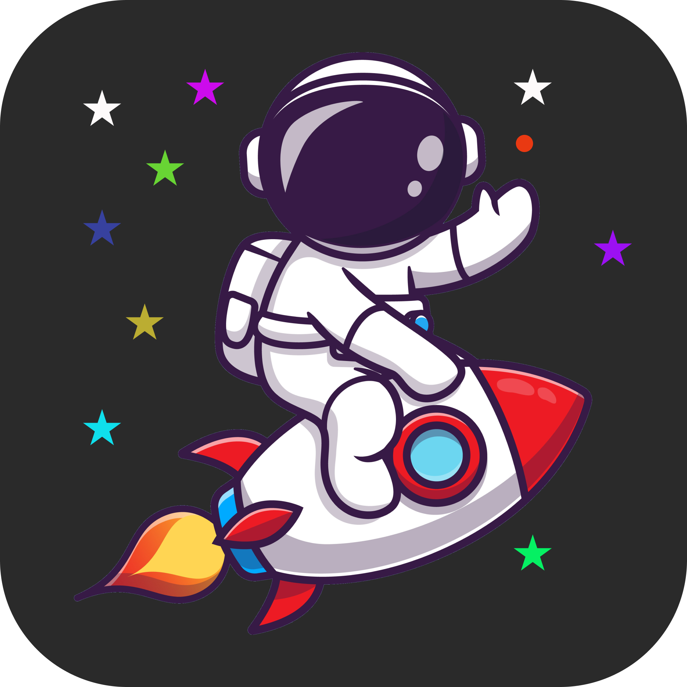
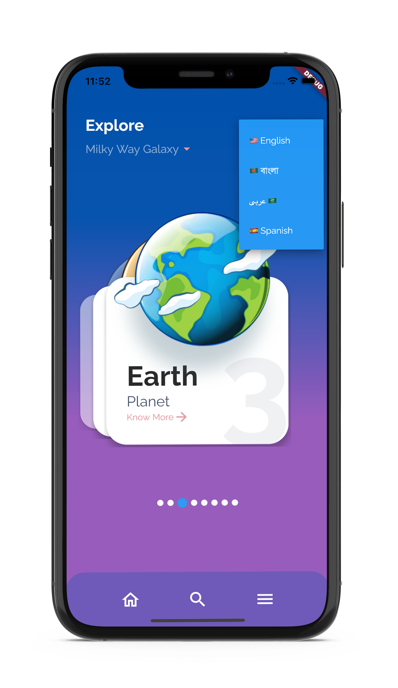
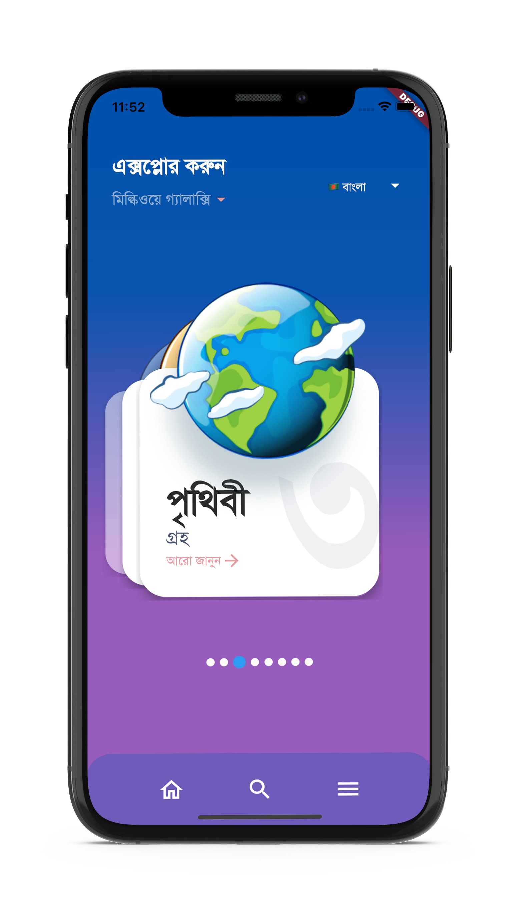
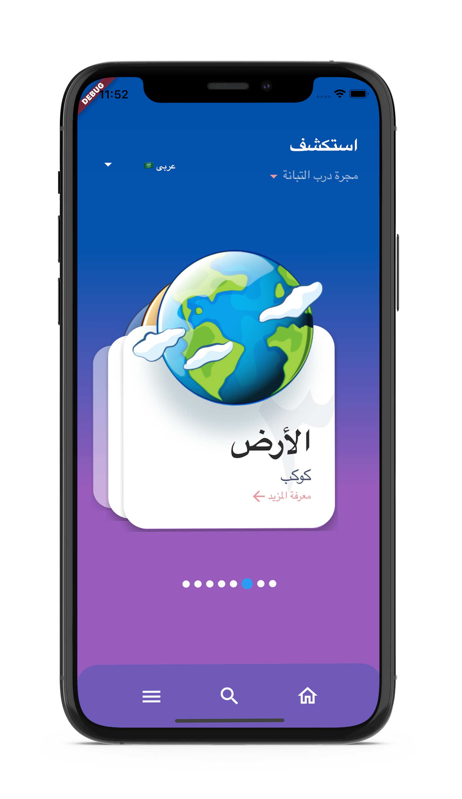
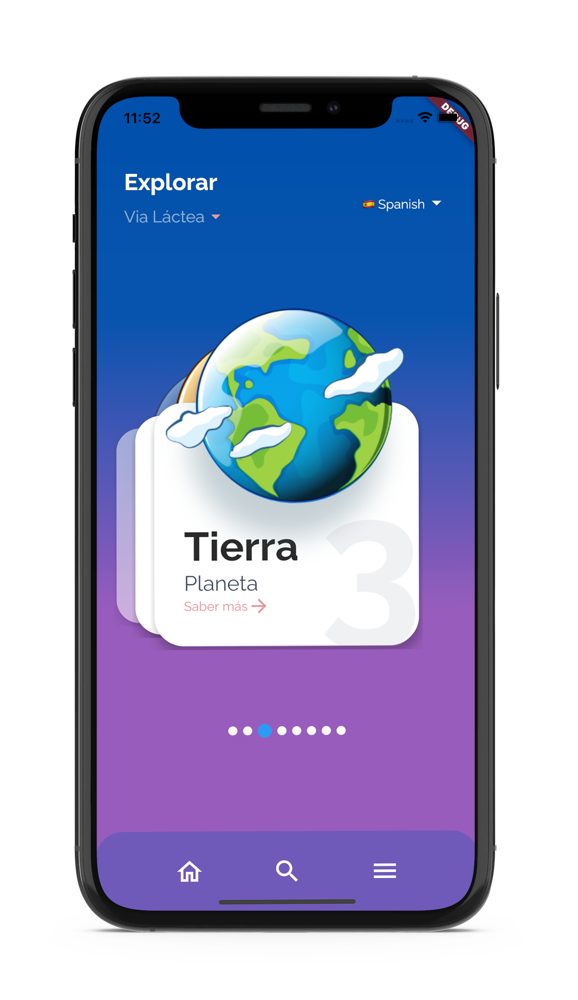
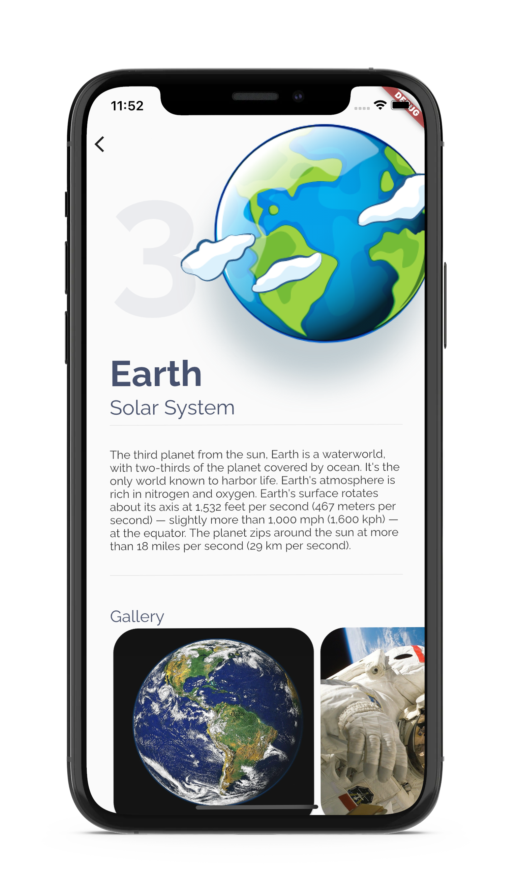
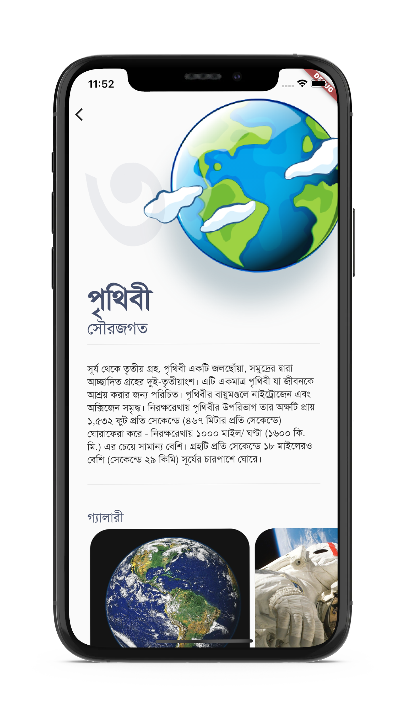

# aDot.

We are a small dot in the whole universe system. Milky way galaxy is one of them. Let's explore Milky Way.

 

> **Please Read** : These translations are done by Google Translate. Kindly ignore any mistake in translations & This is not a production app.

- ### Available In 4 Languages

- ### Bengali

- ### Arabic with RTL Supported

- ### Spanish

 

- ### Translations Across Whole App

> ### [Design Credit Goes Here](https://dribbble.com/shots/6600859-Explore-Universe-App-UI)
 

> ### Image & Logo Credit: <a href='https://www.freepik.com/vectors/logo'>www.freepik.com</a>
 

